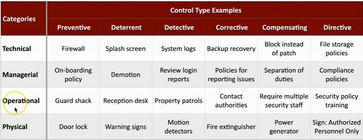

#### ****

#### **Categories**

- **Technical**:
    
    - Controls implemented using technology.
    - Examples: Firewalls, antivirus software, system policies within operating systems.
- **Managerial**:
    
    - Policies and procedures for managing security.
    - Examples: Security policy documentation, onboarding policies, compliance procedures.
- **Operational**:
    
    - Controls relying on human interaction and processes.
    - Examples: Security guards, awareness training, reception desks.
- **Physical**:
    
    - Measures restricting physical access.
    - Examples: Guard shacks, badge readers, fences, locks.

* * *

#### **Control Types**

- **Preventive**:
    
    - Stops events from happening.
    - Examples:
        - **Technical**: Firewall rules.
        - **Managerial**: Onboarding policies.
        - **Operational**: Guard shack ID checks.
        - **Physical**: Door locks.
- **Deterrent**:
    
    - Discourages malicious activity.
    - Examples:
        - **Technical**: Security splash screens.
        - **Managerial**: Threat of demotion for violations.
        - **Operational**: Reception desk monitoring.
        - **Physical**: Warning signs.
- **Detective**:
    
    - Identifies and warns about events.
    - Examples:
        - **Technical**: System logs and login reports.
        - **Managerial**: Log review policies.
        - **Operational**: Patrolling security guards.
        - **Physical**: Motion detectors.
- **Corrective**:
    
    - Responds to and mitigates damage from incidents.
    - Examples:
        - **Technical**: System backups and restorations.
        - **Managerial**: Policies for issue reporting.
        - **Operational**: Contacting authorities.
        - **Physical**: Fire extinguishers.
- **Compensating**:
    
    - Provides temporary or alternative solutions when primary controls fail.
    - Examples:
        - **Technical**: Firewall rules instead of software patches.
        - **Managerial**: Separation of duties.
        - **Operational**: Multiple security guards working concurrently.
        - **Physical**: Power generators for outages.
- **Directive**:
    
    - Provides guidance or instructions for secure practices.
    - Examples:
        - **Technical**: File storage policies for sensitive data.
        - **Managerial**: Compliance and procedural documentation.
        - **Operational**: Security training courses.
        - **Physical**: Signs stating “authorized personnel only.