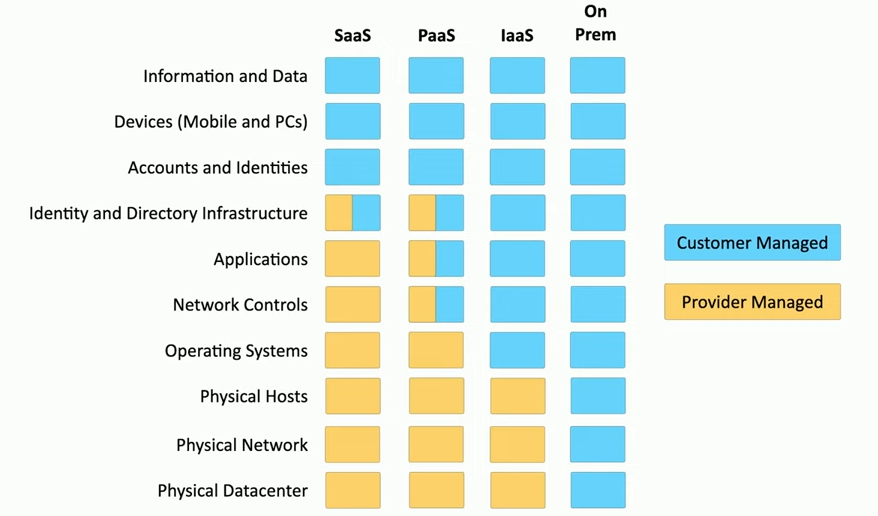
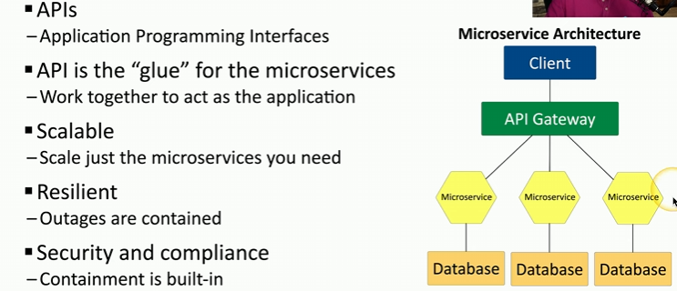
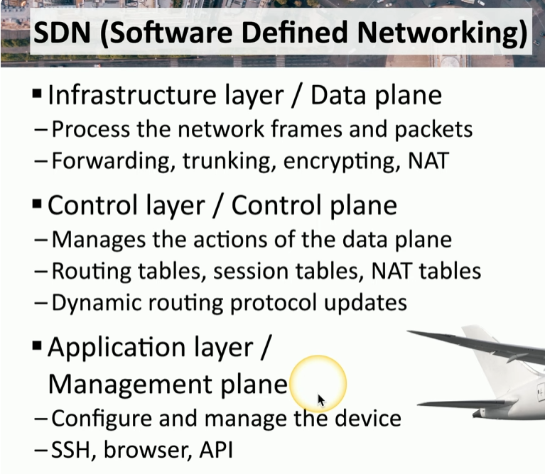
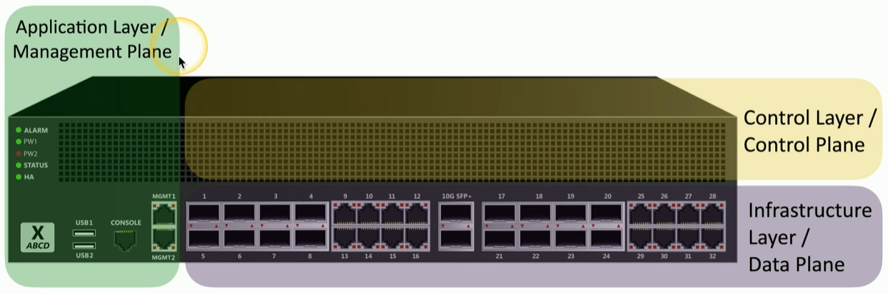
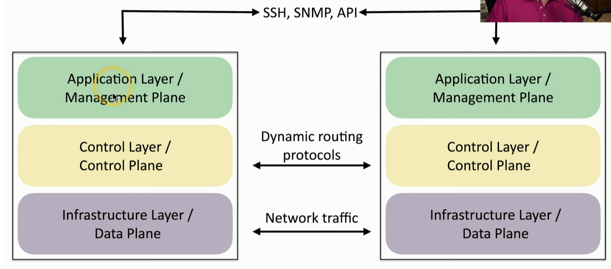

# Architecture and Infrastructure Concepts

## Cloud Architecture

- **Responsibility Matrix**:
    - Cloud providers offer a matrix defining security responsibilities
    - Responsibilities vary by service type (SaaS, PaaS, IaaS)
    - Some responsibilities are shared between customer and provider
    - Example: Operating system responsibility differs based on service model
        - SaaS/PaaS: Provider manages
        - IaaS/On-premises: Customer manages  
             

## Hybrid Cloud Considerations

- Challenges:
    - Multiple cloud providers don't directly communicate
    - Manual configuration required for each provider
    - Potential mismatches in:
        - Authentication settings
        - Server configurations
        - Firewall settings
        - Log management
- Data transfer occurs over public internet, requiring careful security configuration

## Third-Party Vendors

- Best Practices:
    - Implement vendor risk management policy
    - Develop incident response processes involving third parties
    - Continuous monitoring of third-party systems and devices

## Infrastructure as Code (IaC)

- Allows defining infrastructure through code
- Benefits:
    - Easy infrastructure creation and modification
    - Consistent deployment across different cloud providers
    - Enables quick rebuilding and scaling of infrastructure

## Serverless Architecture

- Key Characteristics:
    - Function-based approach
    - Less emphasis on operating system
    - Dynamic function deployment
    - Cost-effective (pay only for used functions)
- Security mostly managed in cloud infrastructure

## Microservices Architecture

- Characteristics:
    - Breaking applications into smaller, independent services
    - Uses APIs for communication
    - Improved scalability and resilience
- Security advantages:
    - Service-specific security configurations
    - Isolated service failures

## Network Infrastructure

### Physical Isolation

- **Air-Gapped Networks**:
    - Physically separate network segments
    - Prevents lateral movement between segments
    - Examples: Separating web and database servers

### Logical Segmentation

- **VLANs (Virtual Local Area Networks)**:
    - Segment network interfaces on same physical switch
    - Prevents direct communication between segments
    - Simplifies network design

### Software-Defined Networking (SDN)

- Three Operational Planes:
    1.  **Data Plane**: Forwards network traffic
    2.  **Control Plane**: Manages routing tables
    3.  **Management Plane**: Configuration and administration
- Enables cloud-based network device creation and management

          

&nbsp;

## SDN DATA FLOWS

## On-Premises vs Cloud Infrastructure

- **On-Premises**:
    - Complete control
    - Higher management costs
    - Direct security decision-making
- **Cloud**:
    - Centralized security
    - No hardware maintenance
    - Provider-managed security
    - Potential cost savings

## Virtualization vs Containerization

### Virtualization

- Each virtual machine (VM) has:
    - Separate guest operating system
    - Own application stack
- Inefficient for identical OS instances

### Containerization

- Shares host operating system
- Isolates applications
- More efficient resource utilization
- Easier application swapping
- Popular platforms like Docker

## Specialized Systems

### IoT (Internet of Things)

- Convenience-focused devices
- Security Risks:
    - Often developed without robust security
    - Single vulnerable device can compromise entire network

### Industrial Control Systems (SCADA/ICS)

- Highly secure, segmented systems
- Used in manufacturing, power generation
- Critical infrastructure protection

### Real-Time Operating Systems (RTOS)

- Deterministic processing
- Used in time-critical systems
- Limited external access
- Prioritizes immediate system responses

### Embedded Systems

- Purpose-built, self-contained devices
- Single-function design
- Minimal external access
- Examples: Traffic lights, medical monitoring equipment

## High Availability Considerations

- Ensures continuous system operation
- Involves:
    - Redundant systems
    - Failover mechanisms
    - Multiple infrastructure components
- Increases costs with added redundancy

Architectural Considerations

## Availability

- Measure of system uptime
- Typically expressed as percentage (e.g., 99.999%)
- Focuses on accessibility for authorized users

## Resilience

- Ability to recover from failures
- Measured by Mean Time To Repair (MTTR)
- Involves quick system restoration

## Cost Considerations

- Includes:
    - Initial installation
    - Maintenance
    - Replacement
    - Depreciation
    - Operational expenses

## Responsiveness

- Speed of service request processing
- Varies with application complexity
- Sensitive to user experience

## Scalability (Elasticity)

- Dynamic resource allocation
- Adjusts to changing load
- Balances performance and cost

## Deployment Ease

- Automated orchestration
- Cloud infrastructure advantages
- Requires comprehensive project planning

## Risk Transference

- Cybersecurity insurance
- Covers potential financial losses
- Helps manage post-incident risks

## Recovery Considerations

- Efficient restoration processes
- Minimal downtime strategies
- Prepared backup and recovery methods

## Patch Management

- Regular security updates
- Testing before production deployment
- Critical for maintaining security posture

## Power Infrastructure

- Crucial for continuous operation
- Backup power solutions
- Uninterruptible Power Supply (UPS)
- Generator options

## Compute Resources

- Processing power allocation
- Cloud-based compute engines
- Scalable computational resources