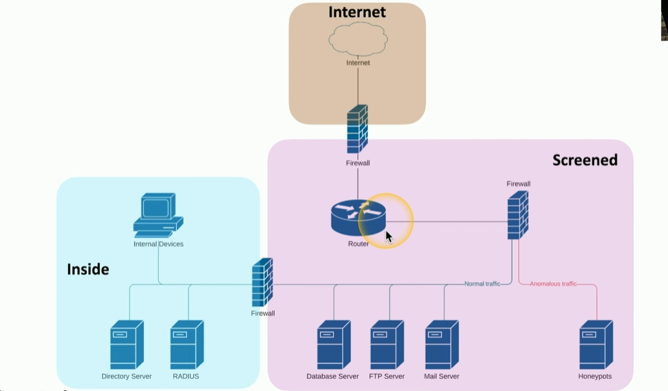

### **Infrastructure Considerations**

- **Device Placement:**  
    Use firewalls to segment networks, place devices in logical security zones (e.g., trusted, untrusted, screened), and design infrastructure with multiple layers for better security and management.
    
- **Security Zones:**  
    Zones logically separate devices by function or access type (e.g., inside, screened, untrusted). They allow granular rule creation, making it easier to manage and secure network traffic.
    
- **Attack Surface:**  
    Minimize vulnerabilities by securing application code, blocking unnecessary ports, and reviewing firewall rules. Constantly monitor for potential openings, including physical security risks like network cabling.
    
- **Connectivity:**  
    Secure physical and logical network connections. Use encryption (e.g., IPsec, VPNs) to protect data transmitted between sites and users.
    
- **Failure Modes:**
    
    - **Fail-Open:** Ensures network availability when a security device fails but allows traffic without filtering.
    - **Fail-Closed:** Blocks all traffic if a device fails, ensuring no unfiltered traffic but potentially causing downtime.

* * *