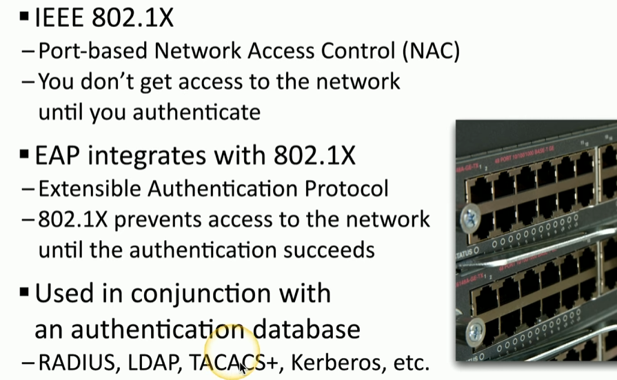

### **Infrastructure Considerations**

- **Device Placement:**  
    Use firewalls to segment networks, place devices in logical security zones (e.g., trusted, untrusted, screened), and design infrastructure with multiple layers for better security and management.
    
- **Security Zones:**  
    Zones logically separate devices by function or access type (e.g., inside, screened, untrusted). They allow granular rule creation, making it easier to manage and secure network traffic.
    
- **Attack Surface:**  
    Minimize vulnerabilities by securing application code, blocking unnecessary ports, and reviewing firewall rules. Constantly monitor for potential openings, including physical security risks like network cabling.
    
- **Connectivity:**  
    Secure physical and logical network connections. Use encryption (e.g., IPsec, VPNs) to protect data transmitted between sites and users.
    
- **Failure Modes:**
    
    - **Fail-Open:** Ensures network availability when a security device fails but allows traffic without filtering.
    - **Fail-Closed:** Blocks all traffic if a device fails, ensuring no unfiltered traffic but potentially causing downtime.

* * *

### **Device Attributes**

- **Active vs. Passive:**
    
    - **Active:** Inline devices (e.g., IPS) monitor and block malicious traffic in real time but may cause disruptions.
    - **Passive:** Non-inline systems (e.g., IDS) only alert to malicious traffic but don’t actively block it, avoiding impact on network performance.

 

**Inline vs. Tap/Monitor:**

- **Inline (its active monitoring):** Devices placed directly in the traffic path for real-time evaluation and blocking.
- **Tap/Monitor (its passive monitoring):** Devices receive copies of traffic via port mirroring or network taps for analysis without interfering with the traffic flow.

* * *

### **Network Appliances**

- **Jump Server:**  
    Acts as a hardened intermediary for accessing internal network devices from outside. Securely manages external-to-internal access with multi-step authentication.
    
    - **Common Use Cases**:
        - Facilitating secure remote access to internal servers or databases.
        - Enforcing a central access point for monitoring and auditing administrative activity.
        - Segmenting and protecting critical systems from direct exposure to the internet.
    - **Protocol Handling**: Typically involves remote access protocols such as SSH, RDP, or VPN connections.
- **Proxy Server:**
    
    - Intermediary for traffic between clients and servers.
        
    - Types: Explicit (configured) and Transparent (invisible to users).
        
    - Features: Caching, URL filtering, and content scanning for enhanced security and efficiency.
        
    - Forward Proxy: Manages outbound traffic.
        
    - Reverse Proxy: Protects internal servers by managing inbound traffic.
        
    - Open Proxy: Publicly accessible and allows any user to connect without authentication. Often used for anonymity but can pose significant security risks.
        
         
        
        **Proxy Servers Use Cases**:
        
        - **Anonymization**: Hides the client's IP address.
        - **Content filtering**: Blocks certain websites or types of traffic.
        - **Caching**: Stores frequently accessed data to improve response time.
        - **Security**: Adds a layer of defense against malicious traffic
        
         
        
        **Protocol Handling**: Often deals with specific protocols like HTTP, HTTPS, FTP, or SOCKS.  
        **Scope**: Can be used for both internal and external traffic routing.  
         
        
        &nbsp;
        
- **Intrusion Prevention System (IPS)/Intrusion Detection System (IDS):**
    
    - **IPS:** Blocks threats in real time (active monitoring). Configurable as fail-open or fail-closed.
    - **IDS:** Alerts administrators to threats without blocking them (passive monitoring).
    - Inline IPS actively evaluates traffic, while passive IPS relies on mirrored traffic for evaluation.
- **Load Balancer:**
    
    - Distributes traffic across servers to optimize performance and ensure fault tolerance.
    - Features: TCP Offload (single tcp session for all users instead of multiple separate sessions), SSL Offload encryption/decryption, caching, content switching, and prioritization.
    - Configurations: Active-active (all servers operational) or Active-passive (standby servers activated on failure).

&nbsp;

- **Sensors:**  
    Collect traffic statistics from devices like switches, routers, firewalls, or standalone sensor units. Use this data for monitoring and analyzing network health and threats.

* * *

### **Port Security**

- **802.1X**  
    Described as an IEEE standard managing the authentication process for users and devices, also referred to as Port-based Network Access Control (NAC).
- **Extensible Authentication Protocol (EAP)**  
    Described as a framework for authentication used behind the scenes for port security, integrated with 802.1X.

The authentication process involves three components: the supplicant (end user or client), the authenticator (switch or access point), and the authentication server (back-end database, such as Active Directory or RADIUS).

1.  **Initial Connection**: When the supplicant connects to the network, the authenticator prevents access until authentication is complete.
2.  **EAP Request**: The authenticator requests login credentials from the supplicant.
3.  **EAP Response**: The supplicant sends a response with the device's identity, which is passed to the authentication server.
4.  **Additional Details Request**: If the server accepts logins, it asks for more details, which the authenticator requests from the supplicant.
5.  **Credential Submission**: The supplicant provides the required credentials (username/password).
6.  **Validation**: The authenticator sends the credentials to the authentication server for validation. If correct, the server approves the login, and the authenticator grants network access.

&nbsp;

* * *

### **Firewall Types**

- **Web Application Firewall (WAF)**  
    Designed for analyzing input to web-based applications, blocking attacks such as SQL injections and cross-site scripting.

****

&nbsp;

- **Unified Threat Management (UTM)**  
    An all-in-one security appliance that includes features like URL filtering, content inspection, malware identification, and VPN endpoint capabilities.

- **Next-Generation Firewall (NGFW)**  
    Operates at OSI layer 7, making forwarding decisions based on applications and including features like intrusion prevention and URL categorization.
    
    - - All data in every packet
    - **Can be called different names**
        
        - Application layer gateway
        - Stateful multilayer inspection
        - Deep packet inspection
    - **Requires some advanced decodes**
        
        - Every packet must be analyzed and categorized before a security decision is determined

### **Next-Generation Firewalls (NGFWs):**

- Examine all traffic to identify applications in use and make forwarding decisions based on them.
- Allow flexibility **beyond port** numbers:
    - Permit Microsoft SQL Server traffic regardless of port number.
    - Allow users to view Twitter but restrict posting.
    - Control YouTube access (e.g., allow or block video viewing).
- Focus on the **application layer**, not just port numbers.

### **Features of Next-Generation Firewalls:**

- **Intrusion Prevention System (IPS):**
    - Maintain a list of known vulnerabilities to allow or block traffic.
- **URL Filtering and Categorization:**
    - Block access to specific types of websites (e.g., gambling).
    - Restrict individual URLs (e.g., blocking espn.com or yahoo.com).

**Layer 4/Layer 7**  
**Traditional firewalls operate at Layer 4 (TCP/UDP port numbers), while NGFWs operate at Layer 7 (application layer).**

* * *

### **Secure Communication/Access**

- **Virtual Private Network (VPN)**  
    Encrypts private data sent across public networks, often involving VPN concentrators or integrated firewall solutions.
- **Remote Access**  
    Facilitated through SSL/TLS VPNs, enabling secure connections for remote users to corporate resources.
- **Tunneling**
    - **Transport Layer Security (TLS)**  
        A protocol used in SSL VPNs for encrypting web server traffic over TCP port 443.
    - **Internet Protocol Security (IPSec)**  
        Used for encrypting and tunneling data in site-to-site VPNs.
- **Software-Defined Wide Area Network (SD-WAN)**  
    Offers flexibility for connecting remote sites and cloud-based applications, dynamically routing traffic efficiently.
- **Secure Access Service Edge (SASE)**  
    A next-generation VPN solution that integrates cloud-based security technologies and connects users securely to cloud-based applications.

* * *

### **Selection of Effective Controls**

- Consider combining solutions like SSL VPNs for end-user access, IPSec for site-to-site VPNs, SD-WAN for efficient cloud connectivity, and SASE for secure, seamless communication.

&nbsp;

&nbsp;