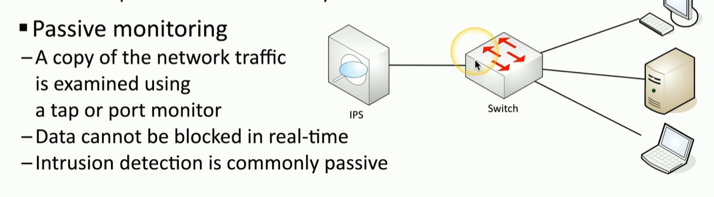

### **Infrastructure Considerations**

- **Device Placement:**  
    Use firewalls to segment networks, place devices in logical security zones (e.g., trusted, untrusted, screened), and design infrastructure with multiple layers for better security and management.
    
- **Security Zones:**  
    Zones logically separate devices by function or access type (e.g., inside, screened, untrusted). They allow granular rule creation, making it easier to manage and secure network traffic.
    
- **Attack Surface:**  
    Minimize vulnerabilities by securing application code, blocking unnecessary ports, and reviewing firewall rules. Constantly monitor for potential openings, including physical security risks like network cabling.
    
- **Connectivity:**  
    Secure physical and logical network connections. Use encryption (e.g., IPsec, VPNs) to protect data transmitted between sites and users.
    
- **Failure Modes:**
    
    - **Fail-Open:** Ensures network availability when a security device fails but allows traffic without filtering.
    - **Fail-Closed:** Blocks all traffic if a device fails, ensuring no unfiltered traffic but potentially causing downtime.

* * *

### **Device Attributes**

- **Active vs. Passive:**
    
    - **Active:** Inline devices (e.g., IPS) monitor and block malicious traffic in real time but may cause disruptions.
    - **Passive:** Non-inline systems (e.g., IDS) only alert to malicious traffic but don’t actively block it, avoiding impact on network performance.

 

**Inline vs. Tap/Monitor:**

- **Inline (its active monitoring):** Devices placed directly in the traffic path for real-time evaluation and blocking.
- **Tap/Monitor (its passive monitoring):** Devices receive copies of traffic via port mirroring or network taps for analysis without interfering with the traffic flow.

* * *
### **Network Appliances**

- **Jump Server:**  
    Acts as a hardened intermediary for accessing internal network devices from outside. Securely manages external-to-internal access with multi-step authentication.
    
- **Proxy Server:**
    
    - Intermediary for traffic between clients and servers.
    - Types: Explicit (configured) and Transparent (invisible to users).
    - Features: Caching, URL filtering, and content scanning for enhanced security and efficiency.
    - Forward Proxy: Manages outbound traffic.
    - Reverse Proxy: Protects internal servers by managing inbound traffic.
- **Intrusion Prevention System (IPS)/Intrusion Detection System (IDS):**
    
    - **IPS:** Blocks threats in real time (active monitoring). Configurable as fail-open or fail-closed.
    - **IDS:** Alerts administrators to threats without blocking them (passive monitoring).
    - Inline IPS actively evaluates traffic, while passive IPS relies on mirrored traffic for evaluation.
- **Load Balancer:**
    
    - Distributes traffic across servers to optimize performance and ensure fault tolerance.
    - Features: SSL decryption, caching, content switching, and prioritization.
    - Configurations: Active-active (all servers operational) or Active-passive (standby servers activated on failure).
- **Sensors:**  
    Collect traffic statistics from devices like switches, routers, firewalls, or standalone sensor units. Use this data for monitoring and analyzing network health and threats.
    

* * *