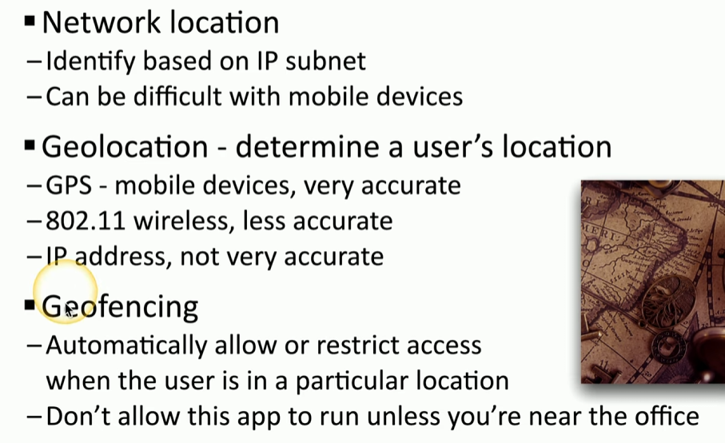

### **Data Types**

- **Regulated:** Data controlled by laws or industry standards, e.g., credit card data under PCI-DSS.
- **Trade Secret:** Proprietary information unique to an organization, essential to competitive advantage.
- **Intellectual Property:** Data protected by copyrights, trademarks, or patents.
- **Legal Information:** Publicly accessible court records with private components such as PII.
- **Financial Information:** Sensitive data like bank account details or corporate financials.
- **Human- and Non-Human Readable Data:** Includes easily interpretable formats (e.g., documents) and encoded forms like barcodes.

* * *

### **Data Classifications**

- **Sensitive:** Includes IP, PII, PHI requiring access control.
- **Confidential:** Requires additional permissions for access.
- **Public:** Openly accessible, like unclassified government information.
- **Restricted:** Access requires NDAs or specific rights.
- **Private:** Limited to internal use, more stringent than restricted.
- **Critical:** Always available, uptime and availability prioritized.

* * *

### **General Data Considerations**

- **Data States:**
    - **Data at Rest:** Stored data, e.g., on SSDs or hard drives. Often encrypted and secured with access permissions.
    - **Data in Transit:** Moving data across networks, protected using encryption (e.g., TLS, VPN).
    - **Data in Use:** Actively processed in memory or CPUs, typically unencrypted, vulnerable to attacks like those on Target's POS systems.
- **Data Sovereignty:** Data subject to the laws of the country it’s stored in (e.g., GDPR requiring EU data to be stored in the EU).
- **Geolocation:** Determines user access rights based on location, using GPS, Wi-Fi, or mobile data. Example: Regional restrictions on streaming services.

* * *

### **Methods to Secure Data**

- **Geographic Restrictions**
    
    - Use geolocation (GPS, IP address, or wireless databases) to identify a user’s location.
    - Implement **geofencing** to control data access based on physical location.
    - Example: Restricting data access to users within a corporate facility.
    - 
- **Encryption**
    
    - Converts plaintext into unreadable ciphertext.
    - Requires proper encryption and decryption keys.
    - Ensures **confusion** (output dramatically differs from input).
    - Example: Encrypting "Hello, world" with PGP results in ciphertext that is secure from third parties.
- **Hashing**
    
    - Creates a fixed-length string (digest) from input data.
    - Used for password storage, file integrity checks, and digital signatures.
    - **Collisions** (two different inputs producing the same hash) are avoided using robust algorithms like SHA-256.
    - Example: Changing one character in a sentence produces a completely different hash.
- **Obfuscation**
    
    - Converts understandable data or code into a less comprehensible form.
    - Used for protecting source code or hiding malicious scripts.
    - Example: Obfuscating a simple PHP script still produces the same output, but the code is harder to read.
- **Data Masking**
    
    - Hides sensitive parts of data while retaining usability.
    - Commonly used for protecting PII or financial details.
    - Example: Showing only the last four digits of a credit card number on receipts.
- **Tokenization**
    
    - Replaces sensitive data with tokens.
    - Tokens are unique and cannot be reverse-engineered to reveal the original data.
    - Example: Mobile payments use one-time tokens instead of transmitting credit card numbers.
- **Segmentation**
    
    - Divides data into smaller, isolated segments stored in separate databases.
    - Reduces the risk of complete data compromise in case of a breach.
    - Example: Storing names in one database and financial details in another with varying security levels.
- **Permission Restrictions**
    
    - Controls user access to data using authentication and authorization.
    - Implements secure login policies, multi-factor authentication, and role-based access.
    - Example: A user in the "HR" group can access employee records, but not financial databases.