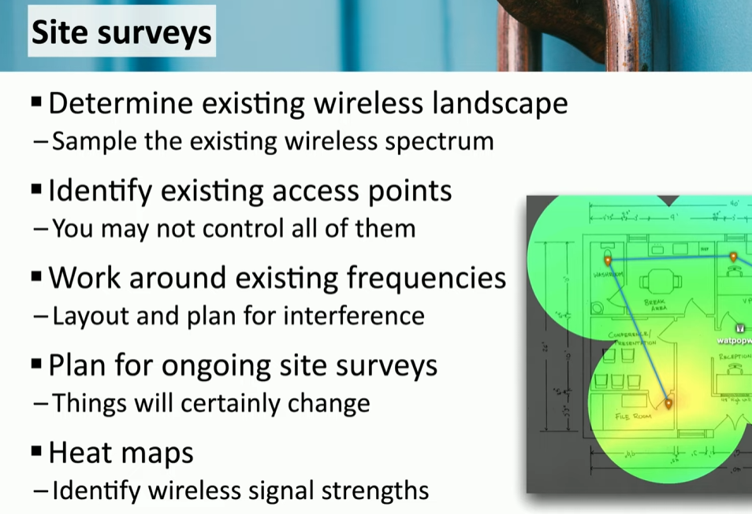
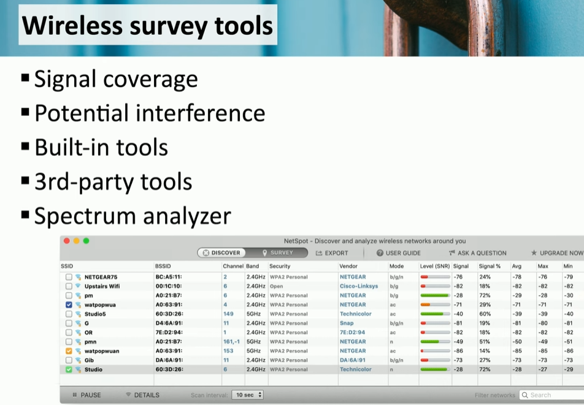
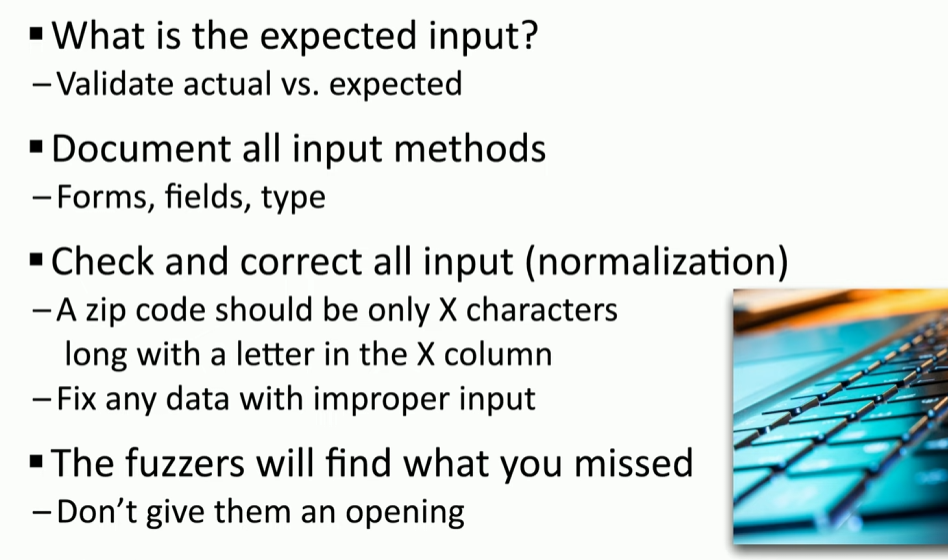
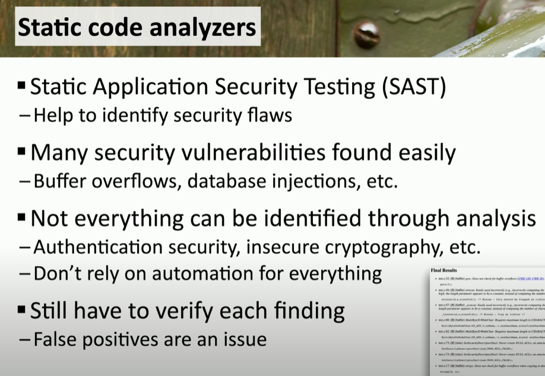
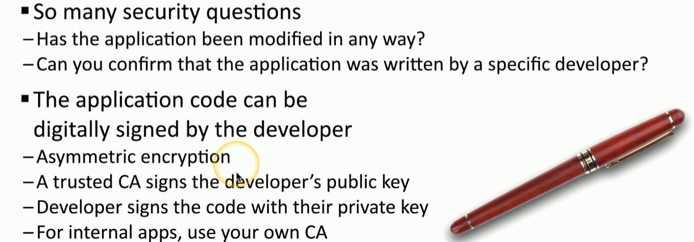

### **Secure Baselines - Establish - Deploy - Maintain**

Security baselines ensure consistent protection for applications and systems.

- **Establishing Baselines**
    
    - Define security configurations for applications, operating systems, and network devices.
    - Utilize vendor-provided templates (e.g., Microsoft Security Compliance Toolkit) for initial guidance.
- **Deploying Baselines**
    
    - Implement configurations across systems using tools like Active Directory Group Policy or Mobile Device Management (MDM).
    - Automate processes for scalable deployment to hundreds or thousands of devices.
- **Maintaining Baselines**
    
    - Regularly audit to ensure settings remain compliant.
    - Update configurations for new vulnerabilities, application changes, or operating system upgrades.
    - Resolve conflicts between multiple vendor-recommended baselines by testing and prioritizing best practices.

* * *

### **Hardening Targets**

- **Mobile Devices**  
    Hardening mobile devices involves patching vulnerabilities with regular updates provided by manufacturers. Device segmentation ensures a logical division between personal and company data, protecting each independently. Using Mobile Device Management (MDM), organizations can enforce security policies, manage app deployments, and monitor device compliance. Security measures include enforcing screen locks, PINs, and encryption for data protection.
- **Workstations**  
    Workstation hardening includes applying operating system and software updates, removing unused applications, and enabling security features like antivirus and Endpoint Detection and Response (EDR). Organizations should configure accounts with least privilege, ensure complex passwords, and monitor for vulnerabilities.
- **Switches and Routers**  
    Switches and routers operate on specialized embedded systems requiring unique hardening practices. Security measures include changing default credentials, implementing centralized authentication, and applying manufacturer-provided patches. Limiting unnecessary services and securing access through firewalls enhance device security.
- **Cloud Infrastructure**  
    Hardening cloud systems focuses on securing access through least privilege configurations and implementing EDR for attack detection. Backups to separate cloud providers ensure disaster recovery readiness. Administrative workstations must be hardened to safeguard the sensitive access they provide.
- **Servers**  
    Securing servers involves regular updates, enforcing password policies, and disabling unused accounts. Employing least privilege, network segmentation, and EDR ensures protection from unauthorized access and malware.
- **ICS/SCADA Systems**  
    Industrial systems use air-gapped, isolated networks for security. Real-time monitoring and limited external access prevent unauthorized control. Ensuring updates for these systems is critical due to their unique vulnerabilities.
- **Embedded Systems**  
    Devices like smart TVs or appliances operate on purpose-built systems, often with limited security measures. Hardening requires patching as soon as updates are available and segregating networks to limit potential exploits.
- **RTOS (Real-Time Operating Systems)**  
    RTOS operates on strict timelines, critical for industrial, military, or automotive applications. They must run with minimal services and be isolated from other systems. Host-based security and network segmentation enhance protection.
- **IoT Devices**  
    IoT security includes rapid patching for firmware updates, network segmentation, and firewall configurations to prevent exploitation. Due to the lack of built-in security expertise from manufacturers, proactive measures are necessary.

* * *

### **Installation Considerations**

- **Site Surveys**  
    Site surveys provide insights into the performance of wireless networks by identifying existing access points and interference sources. Periodic surveys help maintain optimal network configurations as environments evolve.
- **Heat Maps**  
    Heat maps visualize wireless signal strength across areas, helping determine the ideal placement of access points. They are crucial for troubleshooting weak signals and ensuring consistent coverage.

**These practices, combined with secure configurations and continuous monitoring, create a robust and resilient security framework for diverse environments.**

****

****

&nbsp;

* * *

### **Mobile Solutions**

Mobile solutions involve managing and securing mobile devices to support organizational needs effectively.

#### **Mobile Device Management (MDM)**

- MDM is a centralized system to manage mobile devices, whether company-owned or personally owned.
- Enables administrators to enforce policies like screen locks, password requirements, and application installations.
- Provides segmentation, isolating personal and corporate data for security and privacy.

* * *

### **Deployment Models**

These models define how mobile devices are introduced and managed within an organization.

#### **Bring Your Own Device (BYOD)**

- Employees use their personal devices for work purposes.
- Challenges include ensuring compliance with security policies and managing corporate data on personal devices.
- Administrators need to address data deletion on old devices and manage new ones.

#### **Corporate-Owned, Personally Enabled (COPE)**

- Devices are purchased and owned by the company but can be used for personal purposes.
- Offers similar security and segmentation as BYOD while providing the organization greater control.

#### **Choose Your Own Device (CYOD)**

- A variation of COPE, where employees select from a set of corporate-approved devices.
- Devices remain corporate property and are managed like COPE devices.

* * *

### **Connection Methods**

Mobile devices utilize various connection methods, each with its security considerations.

#### **Cellular**

- Operates over 4G/5G standards with geographical cell-based divisions.
- Security concerns include traffic monitoring and location tracking.
- Devices require frequent updates and patches to maintain security.

#### **Wi-Fi**

- Devices should connect to encrypted networks to prevent data interception.
- Public Wi-Fi connections pose risks like on-path attacks and interference.
- VPNs or other encryption tools are recommended for secure connections.

#### **Bluetooth**

- A short-range wireless technology used for personal area networks (PANs).
- Involves a pairing process to establish secure connections.
- Users must avoid automatic connections to unknown Bluetooth devices to prevent unauthorized access.

* * *

#### **Wireless Security Settings**

The video on wireless security settings emphasizes the importance of securing wireless networks using advanced protocols and frameworks:

- **Wi-Fi Protected Access 3 (WPA3)**:
    
    - Addresses weaknesses in WPA2 by implementing stronger encryption with GCMP (Galois Counter Mode Protocol) and SAE (Simultaneous Authentication of Equals) for secure key exchanges.
    - Provides unique session keys per user to prevent eavesdropping on shared networks.
- **AAA and RADIUS**:
    
    - The AAA (Authentication, Authorization, and Accounting) framework governs access control.
    - RADIUS servers are widely used for centralized authentication, integrating with 802.1X protocols to enforce secure logins.
    - Ensures granular access controls and comprehensive session metrics for accountability.
- **Authentication Protocols**:
    
    - Extensible Authentication Protocol (EAP) is employed within 802.1X to allow flexible authentication methods.
    - Supports multi-factor authentication, enhancing security for enterprise networks.
- **Cryptographic Protocols**:
    
    - WPA3 leverages modern cryptographic techniques to ensure data confidentiality and integrity.
    - Removes vulnerabilities like brute-forcing the handshake, present in earlier protocols.

* * *

#### **Application Security**

The video on secure baselines discusses strategies for ensuring application security through consistent configuration and proactive updates:

- **Input Validation**:
    
    - Prevents malicious data injection by ensuring that user inputs meet strict formatting and security criteria.  
        
- **Secure Cookies**:
    
    - Implements cookies with attributes such as `Secure` and `HttpOnly` to prevent exposure over insecure channels and scripting attacks.
- **Static Code Analysis**:
    
    - Automated tools scan source code for vulnerabilities before deployment, ensuring adherence to security baselines.  
        
- **Code Signing**:
    
    - Verifies the authenticity and integrity of application code using digital certificates, protecting against unauthorized modifications.  
        

* * *

#### **Sandboxing**

- Sandboxing isolates applications or processes in controlled environments, ensuring that any malicious behavior or vulnerabilities do not affect the broader system.

* * *

#### **Monitoring**

- Continuous monitoring detects deviations from established security baselines, such as unauthorized configuration changes or new vulnerabilities.
- Employs auditing and logging to maintain compliance and address issues promptly.