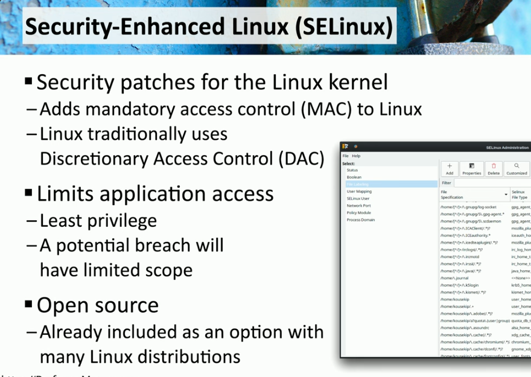
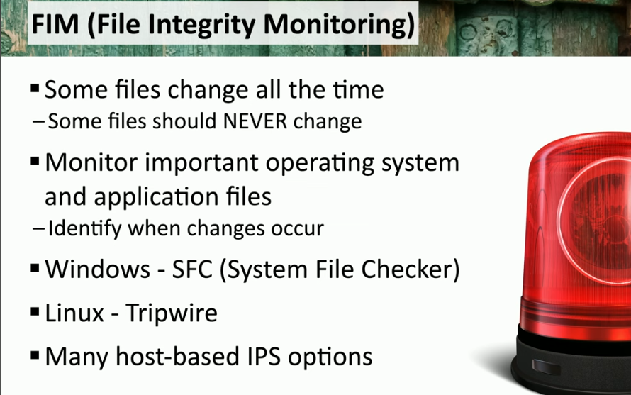
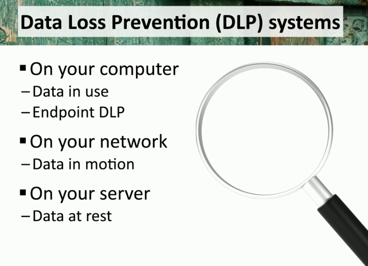

### **Firewall**

- **Definition:** A network security device that monitors and controls incoming and outgoing network traffic based on predetermined security rules.
- **Features:**
    - **Rules:** Allow or block traffic based on IP addresses, applications, or other variables.
    - **Access Lists:** Define permissions for traffic flow.
    - **Ports/Protocols:** Filter traffic by specific port numbers or protocols.
    - **Screened Subnets:** Isolate a network segment for publicly accessible services.
- **Example:** A next-generation firewall can analyze application-layer data and enforce policies for specific applications.
- **Purpose:** Protects internal networks from unauthorized access while enabling controlled communication with external networks.

* * *

### **IDS/IPS**

- **Definition:** Intrusion Detection Systems (IDS) monitor traffic for suspicious activity, while Intrusion Prevention Systems (IPS) actively block such traffic.
- **Features:**
    - **Trends:** Identify patterns of malicious activity over time.
    - **Signatures:** Detect known threats using pre-defined patterns of attack.
- **Example:** An IPS rule might block SQL injection attempts based on observed payloads matching a database attack signature.
- **Purpose:** Enhances network security by detecting and mitigating threats in real-time.

* * *

### **Web Filter**

- **Definition:** A system that restricts or controls the content accessible via the web.
- **Features:**
    - **Agent-Based:** Filters content directly on user devices.
    - **Centralized Proxy:** Routes user traffic through a central server for analysis.
    - **URL Scanning:** Examines web addresses for known malicious sites.
    - **Content Categorization:** Groups websites into categories (e.g., gambling, education) for policy enforcement.
    - **Block Rules:** Prevents access to sites based on organizational policies.
    - **Reputation:** Evaluates the trustworthiness of a site before granting access.
- **Example:** A DNS-based filter blocks known malicious domains from resolving to their IP addresses.
- **Purpose:** Protects users and networks from harmful or inappropriate online content.

* * *

### **Operating System Security**

#### **Group Policy**

- Manages configurations for Windows environments.
- Allows centralized control over users and devices.
- Configured using the Group Policy Management Editor.
- Supports login scripts, security settings, and network configurations.

#### **SELinux (Security-Enhanced Linux)**

- Implements **Mandatory Access Control (MAC)** for Linux systems.
- Ensures least privilege access for users and processes.
- Prevents unauthorized system modifications in case of breaches.

* * *

### **Implementation of Secure Protocols**

#### **Protocol and Port Selection**

- Replace insecure protocols (e.g., Telnet, HTTP, FTP) with secure versions (e.g., SSH, HTTPS, SFTP).
- Common secure ports:
    - Port 443: HTTPS
    - Port 22: SSH
    - Port 993: IMAPS

#### **Transport Method**

- Use encrypted tunnels like VPNs for network-level encryption.
- VPN ensures secure communication over public or untrusted networks.

* * *

### **DNS Filtering**

- Protects users by blocking access to malicious or unauthorized domains.
- Often used to enforce internet usage policies and prevent phishing attacks.

* * *

### **Email Security**

#### **Key Protocols**

1.  **SPF (Sender Policy Framework):**
    
    - Ensures emails are sent from authorized mail servers.
    - Configured using DNS TXT records.
2.  **DKIM (DomainKeys Identified Mail):**
    
    - Adds a digital signature to emails for authenticity.
    - Public keys are stored in DNS TXT records.
3.  **DMARC (Domain-based Message Authentication Reporting and Conformance):**
    
    - Builds on SPF and DKIM.
    - Defines handling of unverified emails (e.g., quarantine or reject).
    - Supports compliance reporting for better visibility.

#### **Email Gateway**

- Inspects incoming and outgoing emails for spam, spoofing, or sensitive data.
- Operates on-premises or via cloud services.

* * *

### **File Integrity Monitoring (FIM)**

- Tracks changes to critical files to prevent tampering.
- **Windows:** System File Checker (SFC).
- **Linux:** Tools like Tripwire provide real-time monitoring.

* * *

### **Data Loss Prevention (DLP)**

#### **Modes of DLP Monitoring**

1.  **Data in Use:** Protects sensitive information in active memory.
2.  **Data in Motion:** Monitors and blocks sensitive data during transmission.
3.  **Data at Rest:** Secures stored data on systems or servers.

#### **Applications**

- Blocks unauthorized USB device usage.
- Monitors cloud applications for sensitive data leaks.
- Detects and prevents data exfiltration via email systems.

* * *

- ### **Endpoint Security**:
    
    - Protects devices like desktops, laptops, and mobile devices, which are common targets for attackers.
    - Requires a layered approach involving various tools and techniques.
- ### **Network Access Control (NAC)**:
    
    - Restricts device access to networks based on compliance with security policies.
    - Tools include:
        - **Persistent agents**: Installed permanently, provide continuous monitoring.
        - **Dissolvable agents**: Temporary and run during login or connection processes.
        - **Agentless NAC**: Integrated with Active Directory, operates during login/logoff.

| **Type** | **Example Trigger** | **Ideal for** |
| --- | --- | --- |
| Persistent Agent | Connecting a managed laptop to Wi-Fi | Corporate devices with long-term monitoring needs |
| Dissolvable Agent | Guest login to corporate Wi-Fi | Temporary or unmanaged devices |
| Agentless NAC | Logging into AD on any device | IoT devices, unmanaged devices, and seamless access |

- ### **Posture Assessments**:
    
    - Regular checks to ensure devices meet security standards.
    - Evaluate antivirus status, software updates, disk encryption, and device trust (e.g., through certificates).
- ### **Endpoint Detection and Response (EDR)**:
    
    - Advanced monitoring of endpoint activities using:
        - Behavioral analysis.
        - Machine learning.
        - Root-cause analysis.
    - Automates responses to threats (e.g., quarantining infected systems, rolling back configurations).
- ### **Extended Detection and Response (XDR)**:
    
    - Extends EDR capabilities by integrating data from multiple sources (e.g., network traffic, user activity).
    - Benefits include:
        - Enhanced detection and reduced false positives.
        - Automated investigation and response across systems.
    - Leverages **user-behavior analytics** to identify anomalies based on normal activity baselines.

### Use Case Benefits:

- **Proactive Security**: Identifying and mitigating threats before they spread.
- **Automated Response**: Minimizing downtime with instant remediation.
- **Comprehensive Visibility**: Better understanding of threats across devices and networks.
- **Efficiency**: Reducing manual investigation efforts through intelligent automation.

| Feature | EDR | XDR |
| --- | --- | --- |
| **Scope** | Endpoint-focused | Multi-layered (endpoint, network, cloud, etc.) |
| **Integration** | Endpoint-centric, standalone | Integrated across security layers |
| **Detection** | Endpoint-specific threats | Cross-domain threat correlation |
| **Response** | Device-level mitigation | Coordinated, multi-vector response |
| **Complexity** | Simple deployment, localized | Broader scope, centralized management |
| **Use Case** | Endpoint security | Holistic security across IT layers |