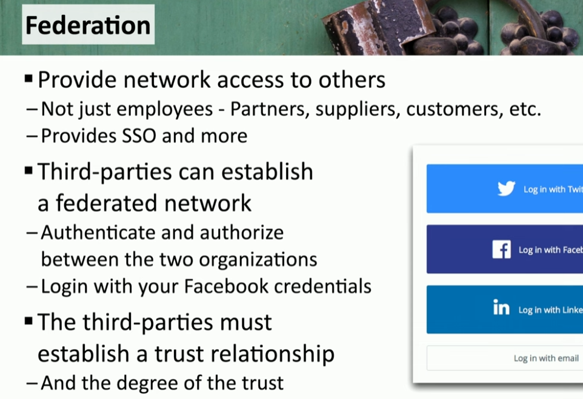
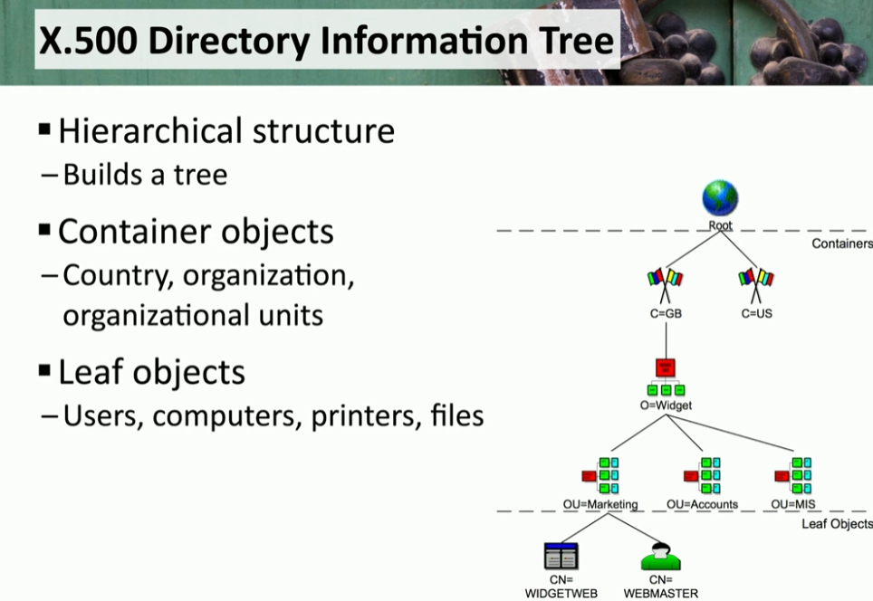
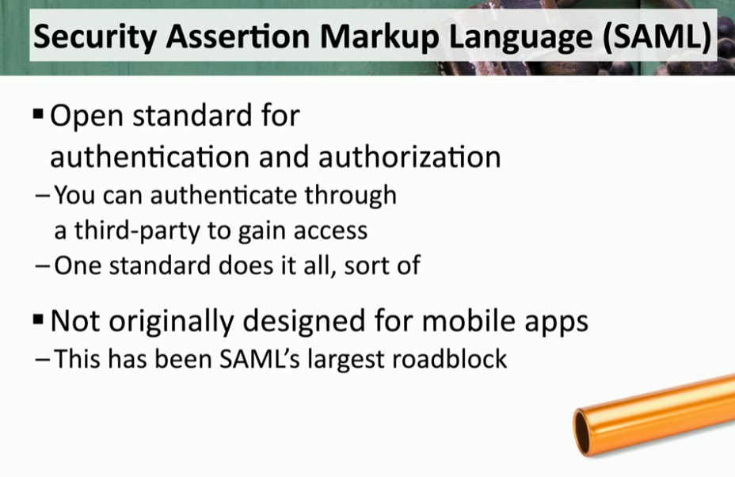

### **Identity and Access Management**

The video explores essential aspects of Identity and Access Management (IAM) in maintaining secure access controls and user permissions:

- **Provisioning/De-provisioning User Accounts**:
    
    - IAM starts with creating a user account during onboarding and ends with its removal during offboarding or role changes.
    - Ensures correct permissions are assigned to align with the user’s responsibilities.
- **Permission Assignments and Implications**:
    
    - Assigns minimal rights to users to prevent misuse, adhering to the principle of least privilege.
    - Limits access to critical systems to protect against unauthorized changes or security breaches.
- **Identity Proofing**:
    
    - Involves verifying a user’s identity through credentials such as passwords or government documents.
    - May use attestation methods like in-person meetings or automated validation processes.
- **Federation**:
    
    - Enables users to authenticate via third-party systems like Google or Facebook, eliminating the need for local authentication databases.

- **Single Sign-On (SSO)**:
    
    - Allows users to log in once and access multiple resources without repeated authentication.
    - Increases convenience and reduces administrative overhead while maintaining security.
- **Lightweight Directory Access Protocol (LDAP)**:
    
    - Facilitates the organization and access of data in a structured directory tree, supporting interoperability across systems.

- **Open Authorization (OAuth)**:
    
    - An authorization framework enabling users to grant third-party applications access to their data without sharing login credentials.

- **Security Assertions Markup Language (SAML)**:
    
    - Provides a standardized mechanism for authenticating users across systems, with a token-based process for access.

- **Interoperability**:
    
    - Ensures compatibility between new and existing systems, such as integrating LDAP servers with VPN concentrators.
- **Attestation**:
    
    - Verifies a user's identity through detailed validation, often required for high-security environments.

* * *

### **Access Controls**

Access controls dictate the policies and rules governing data accessibility within an organization:

- **Mandatory Access Control (MAC)**:
    
    - Labels resources (e.g., confidential, top secret) to define access rights, managed strictly by administrators.
- **Discretionary Access Control (DAC)**:
    
    - Grants data owners the flexibility to determine access permissions for the resources they create.
- **Role-Based Access Control (RBAC)**:
    
    - Assigns permissions based on predefined roles, such as manager or director, simplifying user management.
- **Rule-Based Access Control**:
    
    - Enforces access based on administrator-defined rules, such as time-of-day restrictions or browser type.
- **Attribute-Based Access Control (ABAC)**:
    
    - Incorporates multiple criteria, like IP address and relationship to data, for granular control over resource access.
- **Time-of-Day Restrictions**:
    
    - Limits resource availability to specific times, ensuring access aligns with organizational policies.
- **Least Privilege**:
    
    - Reduces security risks by assigning users only the permissions necessary for their job functions.

* * *

### **Multifactor Authentication (MFA)**

**Authentication Factors:**

1.  **Something You Know**:  
    Examples: Passwords, PINs, or unlock patterns.
2.  **Something You Have**:  
    Examples: Smart cards, USB security keys, or hardware/software tokens (e.g., mobile app codes, SMS codes).
3.  **Something You Are**:  
    Examples: Biometrics like fingerprints, voiceprints, or facial recognition.
4.  **Somewhere You Are**:  
    Examples: GPS-based location verification, or IP address geolocation.

**Best Practices for MFA Implementation:**

- Use multiple factors for better security.
- Combine factors like biometrics with tokens or passwords.

* * *

### **Password Concepts**

**Best Practices for Passwords:**

- **Length**: Use longer passwords (8+ characters minimum).
- **Complexity**: Include uppercase, lowercase, numbers, and special characters.
- **Reuse**: Avoid reusing passwords across multiple accounts.
- **Expiration & Age**: Regularly change passwords as per organizational policy (e.g., every 30-90 days).

**Tools for Managing Passwords:**

1.  **Password Managers**:
    - Securely store and generate strong, unique passwords for each account.
    - Options include OS-integrated managers or third-party solutions.
2.  **Passwordless Authentication**:
    - Examples: Facial recognition, PINs, or biometric logins.
    - Reduces reliance on traditional passwords.

* * *

### **Privileged Access Management (PAM)**

**Techniques for Secure Administration:**

1.  **Just-In-Time Permissions**:
    - Grants temporary admin rights to technicians for specific tasks.
    - Permissions expire automatically after use.
2.  **Password Vaulting**:
    - Centralized storage for sensitive credentials.
    - Avoids exposing primary credentials during operations.
3.  **Ephemeral Credentials**:
    - Temporary, one-time-use credentials created from primary vault credentials.
    - Enhances security by minimizing exposure and risk.