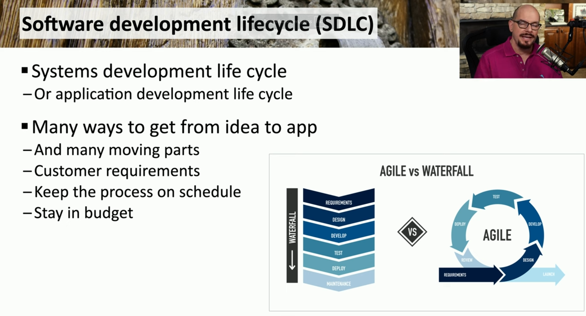

### **Guidelines & Policies**

- **Acceptable Use Policy (AUP)**:
    - Defines appropriate technology usage
    - Applies to all organization members
    - Covers computers, phones, and devices
    - Protects against legal liability
    - Documents user responsibilities
- **Information Security Policies**:
    - Creates master list of security requirements
    - Defines roles and responsibilities
    - Maintains CIA triad (Confidentiality, Integrity, Availability)
    - Addresses security incidents and responses
    - Documents enforcement procedures
- **Business Continuity**:
    - Plans for technology unavailability
    - Documents manual transaction processes
    - Requires pre-incident planning
    - Ensures continuous operations
    - Tests alternative procedures
- **Disaster Recovery**:
    - Addresses widespread disasters
    - Covers natural, technical, and human-caused events
    - Includes recovery location planning
    - Details data recovery procedures
    - Establishes application restoration processes
- **Incident Response**:
    - Details security incident handling
    - Defines team roles and responsibilities:
        - Incident response team
        - IT security management
        - Compliance officers
        - Technical staff
        - User community
    - Follows NIST SP 800-61 guidelines
- **Software Development Lifecycle (SDLC)**:
    - Covers entire application development process
    - Includes requirements through deployment
    - Supports different methodologies:
        - Agile development
        - Waterfall model
    - Ensures on-time, on-budget delivery

- **Change Management**:
    - Implements systematic change processes
    - Requires documentation and approval
    - Includes risk assessment
    - Provides rollback procedures
    - Ensures minimal organizational impact

* * *

### **Standards**

- **Password Standards**:
    - Defines complexity requirements
    - Establishes authentication methods
    - Sets password reset procedures
    - Determines change frequency
    - Specifies storage requirements
- **Access Control**:
    - Determines data access permissions
    - Establishes user access levels
    - Details access removal procedures
    - Requires management approval
    - Documents access policies
- **Physical Security**:
    - Implements ID badge requirements
    - Establishes visitor procedures
    - Defines electronic access controls
    - Requires ongoing monitoring
    - Details escort policies
- **Encryption**:
    - Specifies encryption algorithms
    - Defines hashing requirements
    - Addresses different data states:
        - Data at rest
        - Data in transit
        - Data in use
    - Sets implementation standards

* * *

### **Procedures**

- **Change Management**:
    - Defines scope assessment
    - Requires risk evaluation
    - Establishes formal planning
    - Implements approval process
    - Documents changes
- **Onboarding/Offboarding**:
    - Manages account creation/deletion
    - Assigns equipment and resources
    - Handles data access
    - Processes security clearances
    - Manages asset return
- **Playbooks**:
    - Provides step-by-step procedures
    - Addresses specific security events
    - Integrates with SOAR platforms
    - Updates for emerging threats
    - Documents response actions

* * *

### **External Considerations**

- **Regulatory**:
    - Manages data retention requirements
    - Implements Sarbanes-Oxley (SOX) compliance
    - Enforces HIPAA regulations
    - Maintains application logs
    - Ensures data accessibility
- **Legal**:
    - Establishes reporting procedures for illegal activities
    - Responds to legal holds
    - Manages breach disclosure requirements
    - Handles cloud computing jurisdictions
    - Ensures data sovereignty compliance
- **Industry**:
    - Implements sector-specific security:
        - Public utilities requirements
        - Medical data protection
        - Power generation security
    - Maintains industry standards
    - Adapts security to business needs
- **Local/Regional**:
    - Focuses on area-specific data
    - Manages city/state records
    - Implements local security measures
    - Maintains regional compliance
    - Coordinates with local authorities
- **National**:
    - Addresses federal requirements
    - Handles national defense concerns
    - Coordinates interstate communication
    - Implements national encryption standards
    - Ensures federal compliance
- **Global**:
    - Manages international offices
    - Addresses cross-border data transfer
    - Complies with international laws
    - Implements global security standards
    - Coordinates worldwide operations

* * *

### **Types of Governance Structures**

- **Boards**:
    - Sets broad objectives
    - Provides strategic direction
    - Reviews committee recommendations
    - Approves major changes
    - Oversees organizational governance
- **Committees**:
    - Includes subject matter experts
    - Implements board directives
    - Develops detailed plans
    - Makes tactical decisions
    - Reports to board
- **Government Entities**:
    - Focuses on legal compliance
    - Addresses administrative requirements
    - Manages political considerations
    - Maintains public transparency
    - Follows governmental procedures
- **Centralized/Decentralized**:
    - Centralized:
        - Single decision-making group
        - Unified control structure
    - Decentralized:
        - Distributed decision-making
        - Local authority delegation

* * *

### **Roles and Responsibilities**

- **Owners**:
    - High-level responsibility
    - Oversees broad data management
    - Makes strategic decisions
    - Ultimately accountable
    - Examples: VP of Sales, Treasurer
- **Controllers**:
    - Manages data usage
    - Provides processing instructions
    - Sets data handling policies
    - Oversees data processors
    - Example: Payroll Department
- **Processors**:
    - Handles actual data processing
    - Follows controller instructions
    - Implements data procedures
    - Maintains data security
    - Example: Payroll Company
- **Custodians/Stewards**:
    - Ensures data security
    - Maintains data accuracy
    - Manages compliance
    - Assigns sensitivity labels
    - Controls access permissions